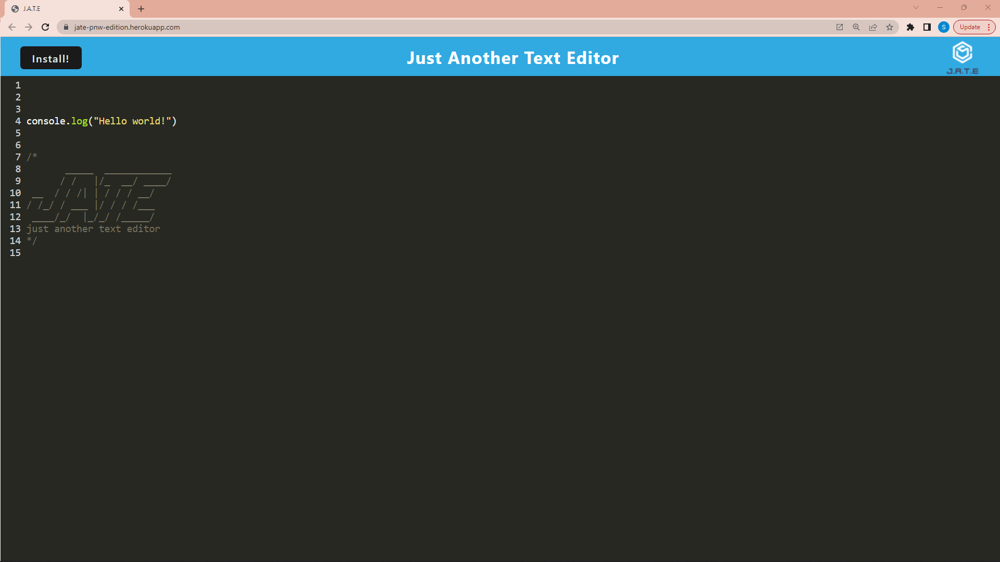

# text-editor

## Description

This application was created to serve as both an online and offline single-page text-editor. The project was created with an emphasis on client-server model and PWA. The application will be able to function offline, with the data being saved with local storage and an indexedDb. The application is bundled with webpak, and will also cache supporting files. The text within the application will also display using javascript syntax highlighting.

## Table of Contents

- [Installation](#installation)
- [Usage](#usage)
- [License](#license)
- [Contributing](#contributing)
- [Tests](#tests)
- [Questions](#questions)

## Installation

Download from Github (Will require user to run through local host) :
https://github.com/samlee088/text-editor

Use live version with Heroku :
https://jate-pnw-edition.herokuapp.com/

## Usage

Once the app initializes for the first time, the app will continue to function if the user goes offline. The user will be able to run with a local host, ie 'localhost:3000', or using the live version uploaded with Heroku, or with a download of the application which will be available once the user visits the webpage for the first time :

## Contributing

NA

## Tests

NA

## Questions

Please reach me with any of the following:
github.com/samlee088
sam.lee088@hotmail.com

## License

[WTFPL License](http://www.wtfpl.net/about/)
